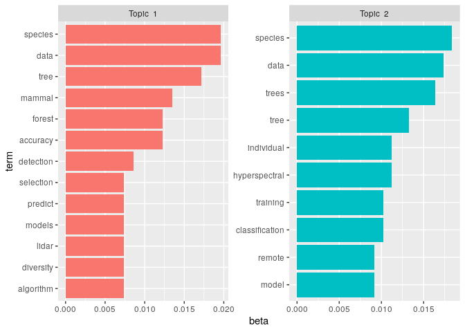

<!-- README.md is generated from README.Rmd. Please edit that file -->

# mnird

(M)achine learning + (N)EON + (I)nstrumentation + literature (R)eview
for + bio(D)iversity

[](https://travis-ci.com/mbjoseph/mnird)
[](https://codecov.io/gh/mbjoseph/mnird?branch=master)

This is a set of utility functions to help with the literature review
and content analysis for a project evaluating biodiversity measurement
at NEON sites using instrumentation and machine learning.

## Installation

``` r
remotes::install_github("mbjoseph/mnird")
```

## Getting started

### Get abstracts

To pull abstracts for all papers in a `.bib` file:

``` r
library(mnird)
library(topicmodels)
library(tidyverse)
library(tidytext)

# you can replace this with a path to a local file
path_to_bib <- system.file("extdata",
                              "neon-biodiversity-instrumentation-ml.bib",
                              package = "mnird")
```

A `.bib` file contains entries like:

``` 

@article{fricker_convolutional_2019,
    title = {A {Convolutional} {Neural} {Network} {Classifier} {Identifies} {Tree} {Species} in {Mixed}-{Conifer} {Forest} from {Hyperspectral} {Imagery}},
    volume = {11},
    issn = {2072-4292},
    url = {https://www.mdpi.com/2072-4292/11/19/2326},
    doi = {10.3390/rs11192326},
    language = {en},
    number = {19},
    urldate = {2019-10-16},
    journal = {Remote Sensing},
    author = {Fricker, Geoffrey A. and Ventura, Jonathan D. and Wolf, Jeffrey A. and North, Malcolm P. and Davis, Frank W. and Franklin, Janet},
    month = oct,
    year = {2019},
    pages = {2326}
}
```

To get the abstracts for each entry:

``` r
abstracts <- get_abstracts(path_to_bib)
#> Registered S3 method overwritten by 'crul':
#>   method                 from
#>   as.character.form_file httr
#> Registered S3 method overwritten by 'hoardr':
#>   method           from
#>   print.cache_info httr
abstracts
#> # A tibble: 17 x 2
#>    doi                    abstract                                         
#>    <chr>                  <chr>                                            
#>  1 10.3390/rs11192326     <jats:p>In this study, we automate tree species …
#>  2 10.3390/rs10010039     <NA>                                             
#>  3 10.7717/peerj.6101     <jats:p>To accelerate scientific progress on rem…
#>  4 10.7717/peerj.5843     <jats:p>Ecology has reached the point where data…
#>  5 10.7717/peerj.6405     <jats:p>Tree species classification using hypers…
#>  6 10.3390/rs11131614     <jats:p>An important application of airborne- an…
#>  7 10.3390/rs11192222     <jats:p>Vegetation structure is a crucial compon…
#>  8 10.1117/1.JRS.9.095990 <NA>                                             
#>  9 10.1016/j.isprsjprs.2… <NA>                                             
#> 10 10.7717/peerj.5666     "<jats:sec>\n<jats:title>Background</jats:title>…
#> 11 10.3390/rs10040649     <NA>                                             
#> 12 10.1109/WHISPERS.2016… <NA>                                             
#> 13 10.1016/j.rse.2019.05… <NA>                                             
#> 14 10.3390/rs11111309     <jats:p>Remote sensing can transform the speed, …
#> 15 10.1101/790071         <jats:title>Abstract</jats:title><jats:p>Tree de…
#> 16 10.1101/556472         <jats:title>Abstract</jats:title><jats:p>Functio…
#> 17 10.7717/peerj.6227     <jats:p>An international data science challenge,…
```

### Perform Latent Dirichlet Allocation to identify topics

First, you need a document-term matrix:

``` r
dt_mat <- get_document_terms(abstracts)
#> Joining, by = "word"
```

Then you can use `topicmodels::LDA` to perform LDA, and visualize the
results. Note that in this case, the topics are nearly identical, since
many of the papers are on the same topic…

``` r
lda <- LDA(dt_mat, k = 2, control = list(seed = 1234))

lda_df <- tidy(lda, matrix = "beta")

top_terms <- lda_df %>%
  group_by(topic) %>%
  top_n(10, beta) %>%
  ungroup() %>%
  arrange(topic, -beta)

top_terms %>%
  mutate(term = reorder_within(term, beta, topic)) %>%
  ggplot(aes(term, beta, fill = factor(topic))) +
  geom_col(show.legend = FALSE) +
  facet_wrap(~ paste("Topic ", topic), scales = "free") +
  coord_flip() +
  scale_x_reordered()
```


